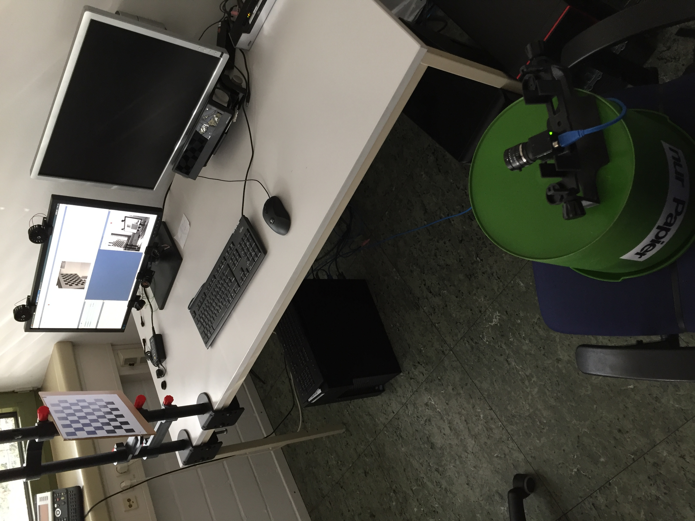

# Camera calibration

The gaze mapping calculation relies on a plane to intersect the gaze ray with, which is the screen in our case.
This plane is given by the screen center and the screen normal vector, labeled `screen_center` and `screen_norm` in `config/config.ini`, respectively.
To determine the screen position with respect to the camera, the extrinsics of the system are calibrated using a stereo calibration procedure.

First, the intrinsics of both cameras are determined using a standard calibration procedure.
Then, the relative positions of both cameras are determined with a checkerboard reference.
Once the extrinsics are known, the position of the screen is determined by displaying a checkerboard pattern and its position with respect to the camera mounted on the screen is determined using the rotation and translation matrices obtained by stereo calibration.

The calibration setup looks like this:


Camera 1 is the one mounted on the screen and camera 2 is the one on the green garbage bin (totally legit calibration setup).
Both cameras need to be able to see the (printed) checkerboard pattern, while camera 2 also needs to be able to see the computer screen.

Note that we use a custom checkerboard calibration image for the screen which matches the screen resolution and has a corner that coincides with the center of the screen.
This corner is used to determine the center of the screen in world coordinates without the need for additional translations.

## Calibration code

The code for the calibration is located in [stereo_calibrate.py](/calibration/stereo_calibrate.py).
Both the mono and stereo calibration codes are adapted from the OpenCV C++ and Python samples and are well explained in the OpenCV documentation both for the [intrinsic](https://docs.opencv.org/2.4/doc/tutorials/calib3d/camera_calibration/camera_calibration.html) and [extrinsic](https://docs.opencv.org/2.4/modules/calib3d/doc/camera_calibration_and_3d_reconstruction.html) calibration.

The rotation and translation matrices of the screen with respect to camera 2 are calculated using OpenCV's [solvePnP()](https://docs.opencv.org/2.4/modules/calib3d/doc/camera_calibration_and_3d_reconstruction.html#solvepnp).

Both the screen and camera matrices (known from stereo calibration) are then converted to a homogeneous transformation matrix $`T_1`$ and $`T_2`$ and the screen's position with respect to camera 1 is determined via $`T_1^{-1} T_2`$.
The center of the screen is then determined using the appropriate checkerboard corner and the screen normal is determined from the cross product of two orthogonal vectors on the screen constructed from any of the checkerboard corners.

## Usage

The calibration code takes a folder of single camera calibration images for each camera, one image for the extrinsic calibration for each camera, and returns the screen center and normal.

An example call for the calibration would be:
```
./stereo_calibrate.py -f cam1_calib cam2_calib --cam1 cam1.png --cam2 cam2.png
```
Here, `cam1_calib` and `cam2_calib` are folders containing the intrinsic calibration images for the two cameras and `cam1.png` and `cam2.png` are the two extrinsic calibration images.
A full list of options is given by calling `./stereo_calibrate.py -h`.
