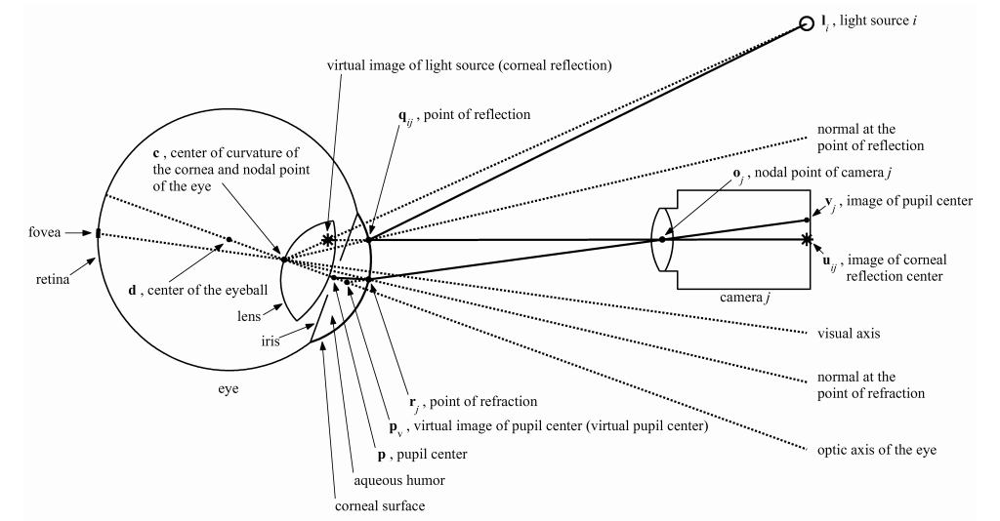

# Mapper

The gaze ray calculation presented here is an implementation of the model-based gaze estimation technique described in [E.D. Guestrin's PhD thesis](https://tspace.library.utoronto.ca/handle/1807/24349) for a system of one camera and two light sources (cf. section 3.2.2).
The functions in [mapper.py](/pyosb/gaze/mapper.py) contain a reference to numbered equations or sections in this thesis where applicable.
All calculations are based on a spherical cornea model.
Variable names follow the same conventions as the thesis and can be understood from the following ray-tracing diagram:

The class consists of two main user functions, namely `GazeMapper.calc_gaze()` and `GazeMapper.calibrate()`, which are used for calculating the gaze ray and for user calibration, respectively.

## Initialization

The gaze mapper class is initialized using the `dict` returned from `Preprocessor.get_wcs_data()` and configuration values containing the camera intrinsics and the system setup (see [config.ini](/config/config.ini)).

## Gaze estimation

The actual gaze estimation involves the following steps:

1. Calculate the WCS coordinates of the center of corneal curvature $`\mathbf{c}`$.
2. With $`\mathbf{c}`$, calculate the pupil center $`\mathbf{p}`$ using either the *implicit* or *explicit* refraction model described in the thesis sections 3.3.3 and 3.3.4, respectively.
3. Together with the distance $`K`$ between the pupil center and the center of corneal curvature, $`\mathbf{c}`$ and $`\mathbf{p}`$ define the *optical axis* of the eye. The value of $`K`$ varies between individuals and needs to be calibrated.
4. Once the optical axis is known, the visual axis is obtained by two rotations given by the angles $`\alpha`$ and $`\beta`$, where $`\alpha`$ is the horizontal and $`\beta`$ is the vertical angular deviation of the visual axis from the optical axis. Both of these need to be determined through a personal calibration as they vary between individuals.
5. Once the visual axis is known, the point of gaze is obtained by intersecting the visual axis with the scene, which is the computer screen in our case.

### Implementation

The gaze estimation is called with the high-level function `calc_gaze()`, which loads previous calibrations or default values from `config.ini`, allows the user to choose between the two refraction models and can optionally visualize the results.

This function calls `single_gaze()` for calculating the gaze for a single eye, which itself sequentially calls `optical_axis()` for calculating the optical axis of the eye, `visual_axis()` for calculating the visual axis and `scene_intersect()` to get the point of gaze in the scene.

The optical axis calculation in `optical_axis()` calculates the center of corneal curvature by solving the minimization problem given in equation (3.11) and implemented in `calc_curvature_center()`.
Afterwards, the pupil center is obtained with one of the refraction models implemented in `implicit_refraction()` or `explicit_refraction()`.
All other calculations are contained in the functions described above with comments pointing to the thesis equations.

## Calibration

The calibration implemented in `calibrate()` uses recordings containing gaze targets and optimizes the values of $`R`$ (radius of corneal curvature), $`K`$ (distance between pupil center and center of corneal curvature), $`\alpha`$, and $`\beta`$ (optical/visual axis rotation angles) to minimize the distance between the calculated gaze points and the gaze targets.

Note, however, that while it is technically possible to optimize $`R`$, this does not really work with the current implementation of the gaze estimation because $`R`$ needs to be known for the calculation of the center of corneral curvature.

The relevant arguments for the `calibrate()` function are:

- `remove_outliers`: If `True`, discards outliers in the recording data using a modified $`z`$-score method implemented in `is_outlier()` before performing the calibration.
- `refraction_type`: String specifying which refraction model to use. Options are `explicit` and `implicit`.
- `eye`: String specifying which eye to calibrate. Options are `left` and `right`.
- `target_idx`: List of indices of calibration targets to use. Pass an empty list to use all targets. Useful to see how good the calibration can match a single target.
- `use_mean`: If `True`, only uses the mean of the gaze points for each target. This is significantly faster than using all recording frames for calibration. Should only be switched to `False` for debugging.
- `show_results`: If `True`, plots the calibrated vs uncalibrated gaze points in the scene.
