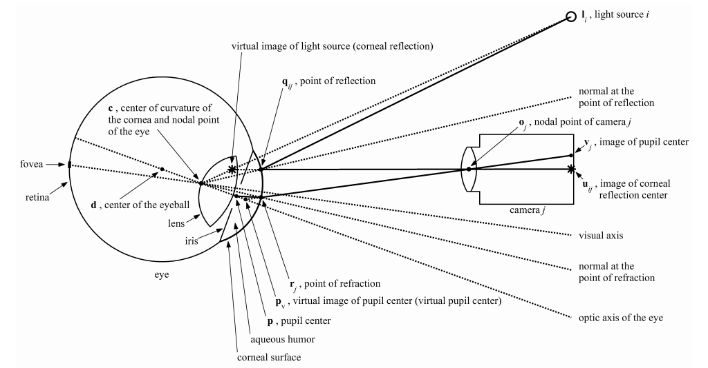

# PyOSB

PyOSB is a Python module that calculates a gaze ray from EyeOSB recordings (in JSON format).
The module consists of a [parser](/pyosb/fileio/eyeosbparser.py) that converts the JSON recordings to a [pandas DataFrame](https://pandas.pydata.org/pandas-docs/stable/reference/api/pandas.DataFrame.html), a [preprocessor](/pyosb/preprocess/preprocess.py) that rescales and rotates the recording data, and a [mapper](/pyosb/gaze/mapper.py) that does the actual gaze ray estimation.
Additionally, the module contains an unfinished [rabbitMQ receiver class](/pyosb/rabbitmq/receiver.py) that was originally intended to be able to receive the recording data live from EyeOSB.

## Parser

The parser implemented in [eyeosbparser.py](/pyosb/fileio/eyeosbparser.py) converts EyeOSB JSON recordings to pandas DataFrames and can optionally save it to an output file.
Most of what the parser does is trivial, the only noteworthy exception being that it modifies the JSON data so that pandas can interpret it correctly.
This preprocessing step is implemented and documented in `EyeInfoParser.preprocess()`.

### Usage

The `EyeInfoParser` is initialized with a path to the EyeOSB JSON recording.
The DataFrame can then simply be returned with a call to `EyeInfoParser.get_dataframe()`.

## Preprocessor

The `Preprocessor` class does a few things:

    1. Convert the pupil and reflex positions to the correct pixel values because EyeOSB stores them relative to the eye patch.
    2. If the recording already contains gaze points (useful for comparisons), rescale them from $`\left[0, 1 \right]`$ to mm and recenter their origin to coincide with the center of the screen. Afterwards, rotate them using the extrinsic calibration (see [Camera calibration](camera_calibration.md)) so that the WCS origin sits at the center of the camera image plane (camera sensor).
    3. Recenter reflex and pupil coordinates so that they coincide with the calibrated center of the camera image sensor (WCS origin) and rescale them from pixels to mm.
    4. Calculate the positions of the light sources (measured by hand as offsets from the upper edge of the screen) in WCS through translation and rotations.
    5. Add third axis to 2D image points ($`z = 0`$ on camera plane).
    6. Drop all frames which don't have pupil and reflex positions.

### Usage

The preprocessor is initialized with the pandas DataFrame returned from `EyeInfoParser.get_dataframe()` and the config options containing the camera intrinsics, the screen information (resolution, center, normal), and the position of the light sources (see [config.ini](/config/config.ini)).

Afterwards, the preprocessed data can be returned as a `dict` using `Preprocessor.get_wcs_data()`, which the `GazeMapper` then uses for gaze estimation.

## Mapper

The gaze ray calculation presented here is an implementation of the model-based gaze estimation technique described in [E.D. Guestrin's PhD thesis](https://tspace.library.utoronto.ca/handle/1807/24349) for a system of one camera and two light sources.
The functions in [mapper.py](/pyosb/gaze/mapper.py) contain a reference to numbered equations or sections in this thesis where applicable.
All calculations are based on a spherical cornea model.
Variable names follow the same conventions as the thesis and can be understood from the following ray-tracing diagram:

The class consists of two main user functions, namely `GazeMapper.calc_gaze()` and `GazeMapper.calibrate()`, which are used for calculating the gaze ray and for user calibration, respectively.

### Initialization

The gaze mapper class is initialized using the `dict` returned from `Preprocessor.get_wcs_data()` and configuration values containing the camera intrinsics and the system setup (see [config.ini](/config/config.ini)).

### Gaze estimation
